# QPDK — Superconducting Quantum RF Process Design Kit

<!-- BADGES:START -->

[](https://gdsfactory.github.io/quantum-rf-pdk/)
[](https://gdsfactory.github.io/quantum-rf-pdk/qpdk.pdf)
[](https://mybinder.org/v2/gh/gdsfactory/quantum-rf-pdk/HEAD)
[](https://pypi.org/p/qpdk)
[](https://choosealicense.com/licenses/mit/)
[](https://gdsfactory.github.io/quantum-rf-pdk/)
[](https://github.com/gdsfactory/quantum-rf-pdk/actions/workflows/test.yml)
[](https://github.com/gdsfactory/quantum-rf-pdk/actions/workflows/drc.yml)
[](https://github.com/gdsfactory/quantum-rf-pdk/actions/workflows/test.yml)
[](https://github.com/gdsfactory/quantum-rf-pdk/actions/workflows/test.yml)
[](https://github.com/gdsfactory/quantum-rf-pdk/issues)
[](https://github.com/gdsfactory/quantum-rf-pdk/pulls)

<!-- BADGES:END -->

______________________________________________________________________

**QPDK** is an open-source, generic process design kit (PDK) for superconducting quantum RF applications built on
[gdsfactory](https://gdsfactory.github.io/gdsfactory/). It provides a complete library of parametric quantum circuit
components — transmon qubits, coplanar waveguide resonators, Josephson junctions, airbridges, SNSPDs, and more — along
with analytical S-parameter models, routing utilities, and full test-chip examples ready for tape-out.

Whether you are a quantum hardware researcher prototyping a new qubit architecture, a process engineer validating a
fabrication flow, or a student learning superconducting circuit design, QPDK gives you a scriptable, version-controlled
foundation to go from concept to GDSII in minutes.

## Key Features

- **Rich component library** — Transmons, fluxonium, unimon qubits, CPW resonators, interdigital capacitors, SQUID
  junctions, meander inductors, SNSPDs, airbridges, launchers, bump bonds, TSVs, and more.
- **Parametric & composable** — Every component is a parametric Python function decorated with `@gf.cell`. Combine cells
  into hierarchical designs or define full test chips in YAML.
- **Analytical circuit models** — S-parameter models for resonators, couplers, waveguides, and junctions powered by
  [SAX](https://flaport.github.io/sax/) and JAX for fast, differentiable simulations.
- **Automated routing** — CPW-aware routing strategies with auto-tapers and airbridge insertion for complex multi-qubit
  layouts.
- **Magnetic vortex trapping** — Built-in utilities to fill ground planes with vortex-trapping hole arrays for improved
  coherence.
- **KLayout integration** — Layer definitions, technology files, and cross sections that install directly into KLayout
  for immediate visual inspection.
- **Regression-tested** — Every component is covered by GDS regression tests, netlist round-trip checks, and model
  validation with 200+ automated tests across Python 3.12–3.13 on Linux, macOS, and Windows.
- **Notebook-driven workflows** — Jupyter notebooks for resonator frequency modeling, Monte Carlo tolerance analysis,
  Hamiltonian parameter extraction with scqubits, pulse-level simulation with QuTiP, and capacitor optimization with
  Optuna.

## Component Gallery

QPDK ships with a broad set of ready-to-use superconducting circuit components. Browse the full interactive catalog in
the [documentation](https://gdsfactory.github.io/quantum-rf-pdk/cells.html).

### Qubits

|                   Transmon                    |                    Fluxonium                    |
| :-------------------------------------------: | :---------------------------------------------: |
|     Double-pad capacitively shunted qubit     |          Superinductance-shunted qubit          |
| 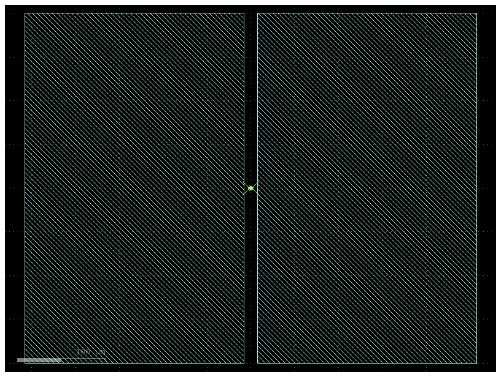 | 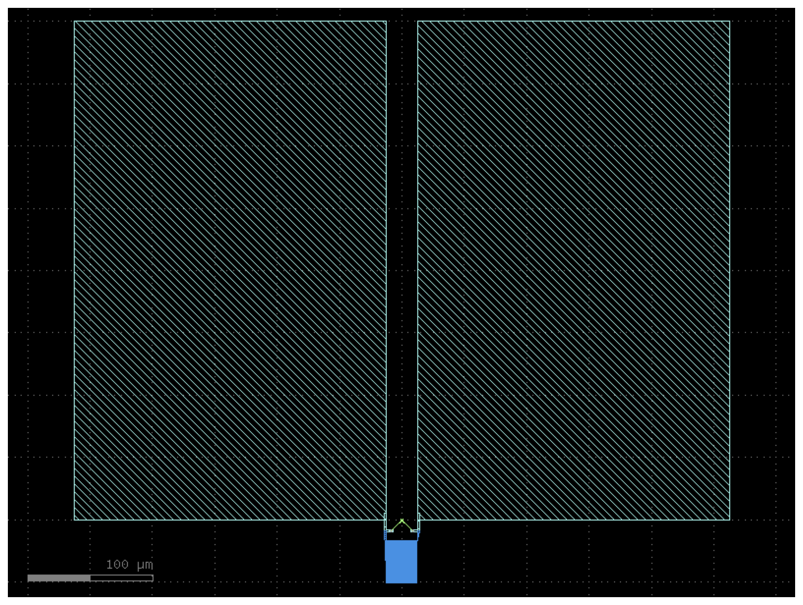 |

|                  Unimon                   |                   SQUID Junction                    |
| :---------------------------------------: | :-------------------------------------------------: |
|     Resonator-embedded junction qubit     |     Superconducting quantum interference device     |
| 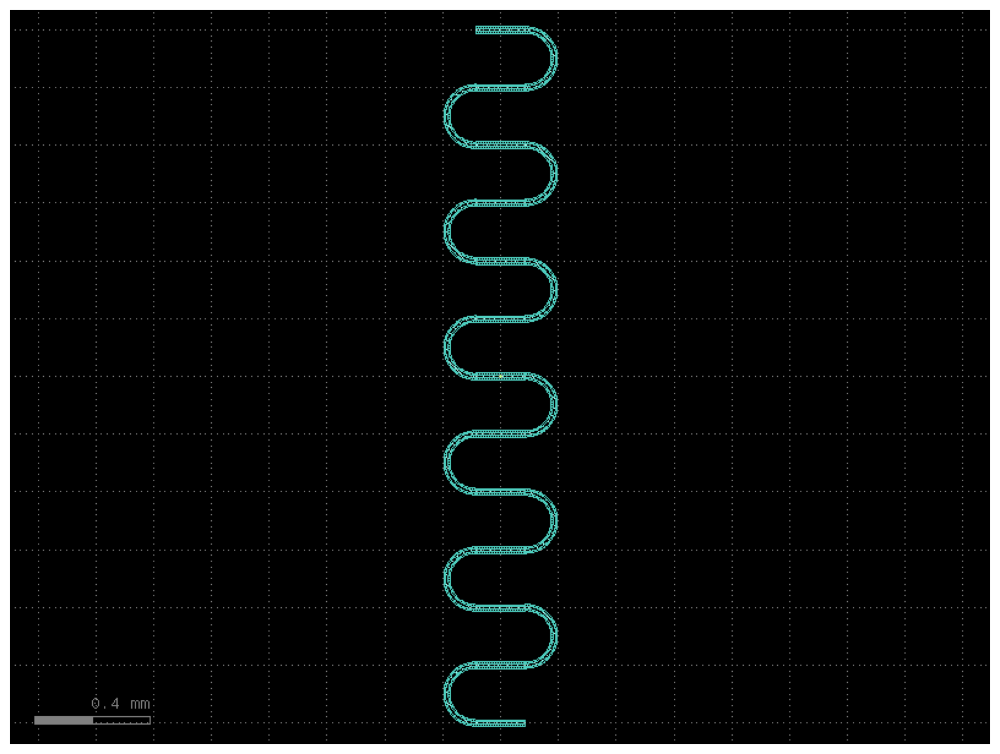 | 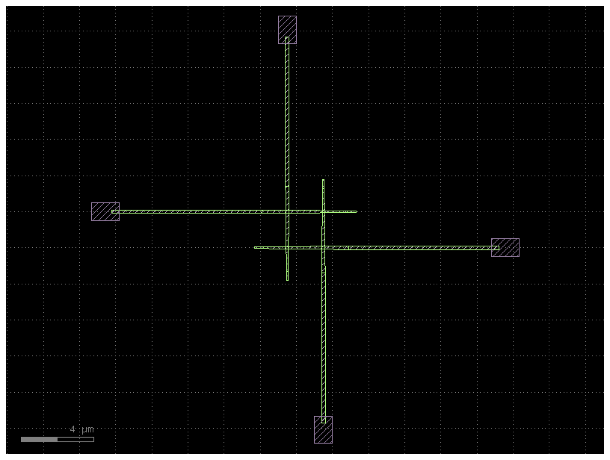 |

### Passive Components

|                    CPW Resonator                    |                    Interdigital Capacitor                    |
| :-------------------------------------------------: | :----------------------------------------------------------: |
|       Meandering coplanar waveguide resonator       |            Finger-style lumped-element capacitor             |
| 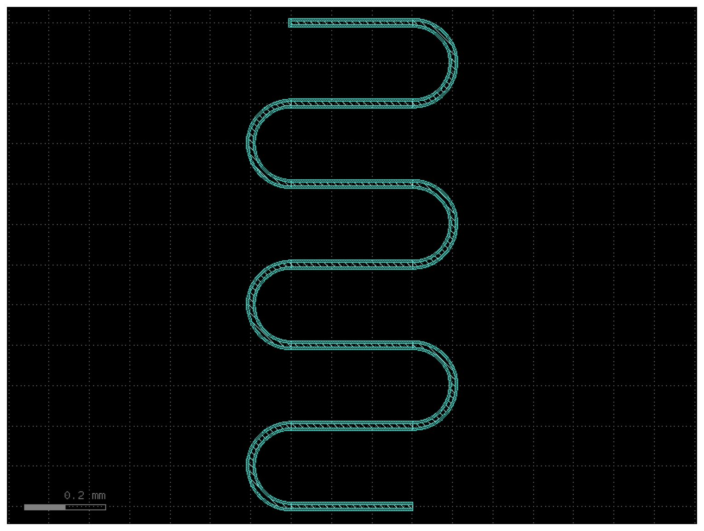 | 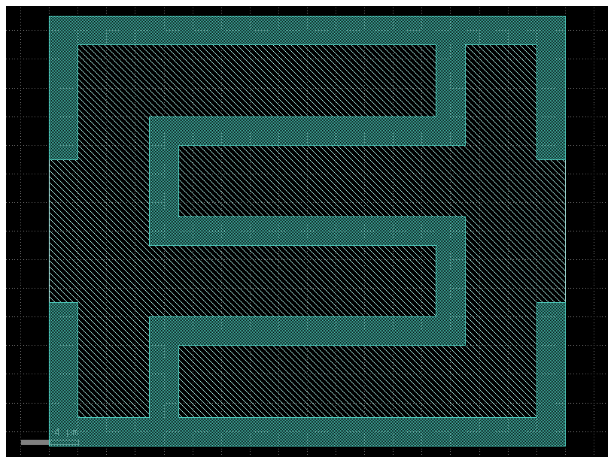 |

|                      SNSPD                      |                    Airbridge                    |
| :---------------------------------------------: | :---------------------------------------------: |
| Superconducting nanowire single-photon detector |     Elevated crossover for signal integrity     |
|          | 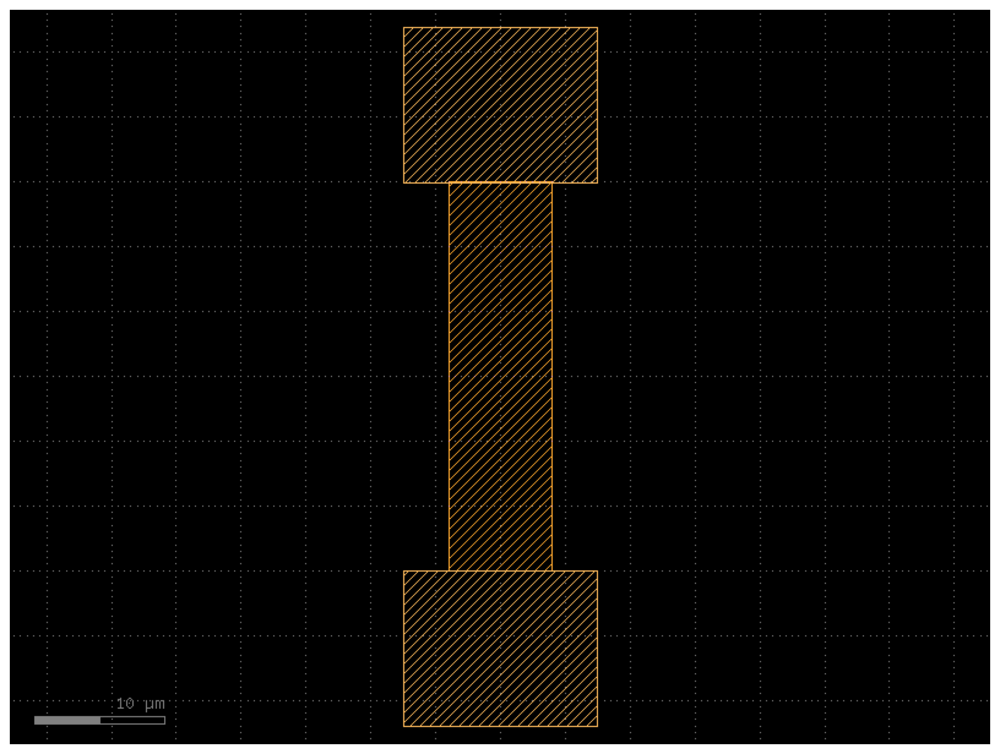 |

### Composite Components

**Transmon with Resonator & Probeline** — Readout-ready qubit cell with coupled resonator and measurement line:

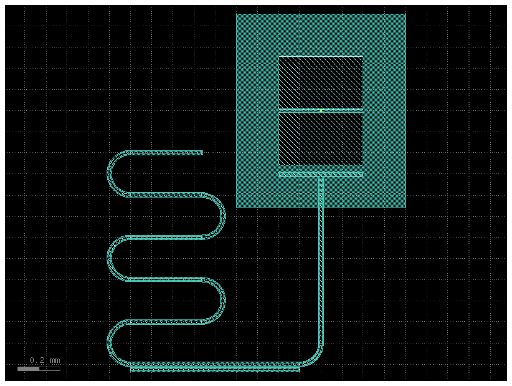

## Sample Test Chips

QPDK includes complete, tape-out-ready test chip examples that demonstrate real-world design workflows.

### Qubit Test Chip

A four-transmon test chip with coupled readout resonators, probeline routing, flux lines, and launchers — defined
entirely in YAML and ready for fabrication.

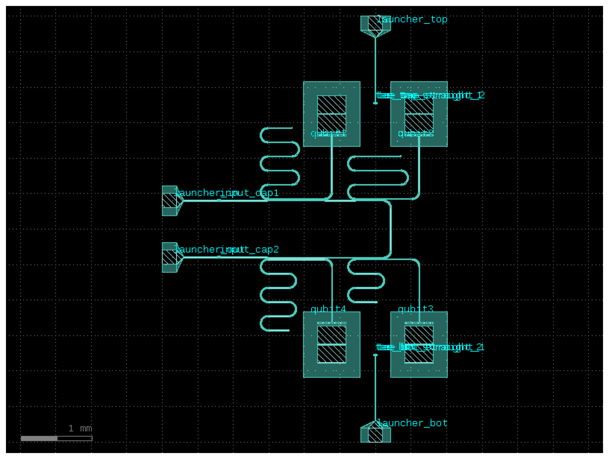

### Filled Qubit Test Chip

The same qubit test chip with magnetic vortex trapping holes filling the ground plane, chip edge metallization, and
additive metal post-processing — as used in real millikelvin experiments.

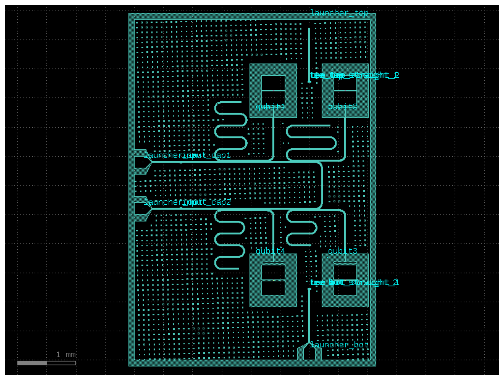

### Resonator Test Chip

A 16-resonator characterization chip with systematically varied CPW widths and gaps across two probelines — ideal for
extracting loss tangent and kinetic inductance.

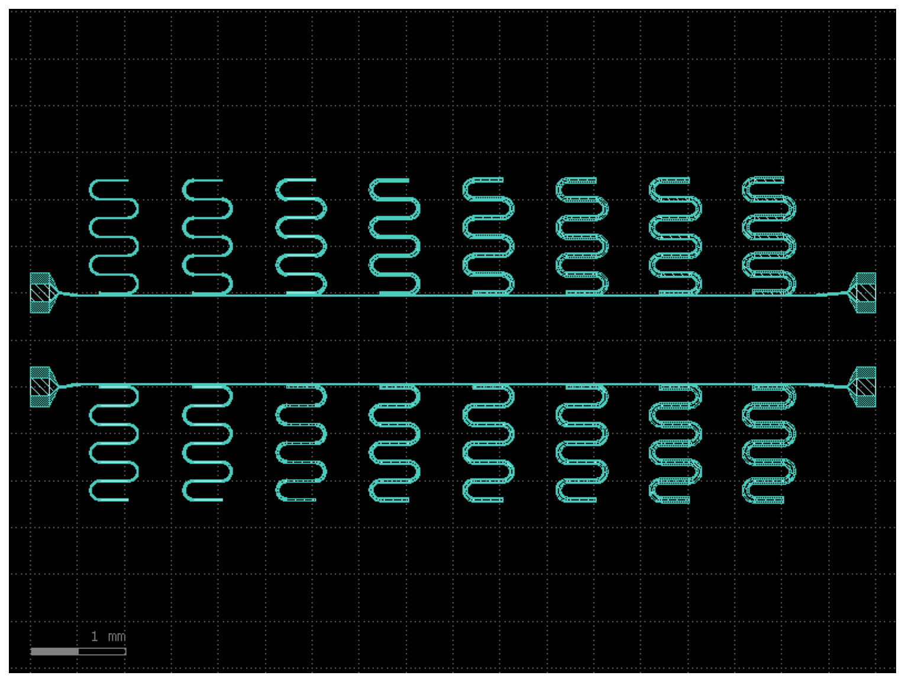

## Quick Start

```python
import gdsfactory as gf
from qpdk import PDK

PDK.activate()

# Create a transmon qubit
from qpdk.cells.transmon import double_pad_transmon

qubit = double_pad_transmon(pad_size=(250, 400), pad_gap=15)
qubit.plot()
```

```python
# Build a complete test chip from YAML
from gdsfactory.read import from_yaml
from qpdk import tech

chip = from_yaml(
    "qpdk/samples/qubit_test_chip.pic.yml",
    routing_strategies=tech.routing_strategies,
)
chip.show()  # Opens in KLayout
```

## Examples & Notebooks

- **[PDK cells in the documentation](https://gdsfactory.github.io/quantum-rf-pdk/cells.html)** — Interactive gallery of
  all available geometries with live parameter controls.
- **[`qpdk/samples/`](https://github.com/gdsfactory/quantum-rf-pdk/tree/main/qpdk/samples)** — Example layouts and
  simulations including qubit test chips, resonator arrays, routing demos, and 3D exports.
- **[`notebooks/`](https://github.com/gdsfactory/quantum-rf-pdk/tree/main/notebooks)** — Jupyter notebooks covering:
  - Resonator frequency modeling and S-parameter analysis
  - Circuit simulation with SAX
  - Monte Carlo fabrication tolerance analysis
  - Hamiltonian parameter extraction with scqubits
  - Pulse-level quantum gate simulation with QuTiP
  - Capacitor geometry optimization with Optuna
  - Dispersive shift calculation with Pymablock
  - Transmon design optimization with NetKet
  - JAX backend comparison for model performance
- **[gsim example notebooks](https://gdsfactory.github.io/gsim/)** — Electromagnetic simulation examples using Palace
  and Meep with gdsfactory.

## Installation

We recommend using [`uv`](https://astral.sh/uv/) for package management. [`just`](https://github.com/casey/just) is used
for project-specific recipes.

### Installation for Users

Install the package with:

```bash
uv pip install qpdk
```

Or with pip:

```bash
pip install qpdk
```

Optional dependencies for the analytical models and simulation tools (SAX, scqubits, JAX) can be installed with:

```bash
uv pip install qpdk[models]
```

### KLayout Technology Installation

To use the PDK in KLayout (for viewing GDS files with correct layers and technology settings), install the technology
files:

```bash
python -m qpdk.install_tech
```

> [!NOTE]
> After installation, restart KLayout to ensure the new technology appears.

### Installation for Contributors

For contributors, please follow the [installation and development workflow instructions](docs/CONTRIBUTING.md).

## Project Structure

```text
qpdk/                   Core Python package
  cells/                Component definitions (transmons, resonators, capacitors, …)
  models/               Analytical S-parameter and circuit models
  samples/              Example layouts and complete test chips
  klayout/              KLayout technology files
  tech.py               Layer stack, cross sections, routing strategies
tests/                  200+ regression and unit tests
notebooks/              Jupyter notebooks for design and simulation workflows
docs/                   Sphinx documentation (HTML + PDF)
```

## Documentation

- [Quantum RF PDK documentation (HTML)](https://gdsfactory.github.io/quantum-rf-pdk/)
- [Quantum RF PDK documentation (PDF)](https://gdsfactory.github.io/quantum-rf-pdk/qpdk.pdf)
- [gdsfactory documentation](https://gdsfactory.github.io/gdsfactory/)

## Contributing

We welcome contributions of all sizes — new components, improved models, bug fixes, documentation, and notebook
tutorials. Please see the [contributing guide](docs/CONTRIBUTING.md) to get started.

## License

QPDK is released under the [MIT License](LICENSE).
