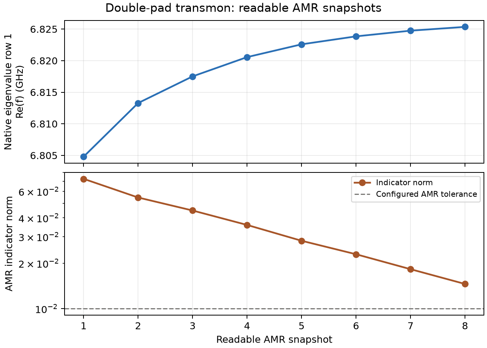

#############################################
 Double-pad transmon: partial AMR diagnostic
#############################################

This is a 2026-09-24 recorded execution of the public :doc:`Palace transmon Surface-EPR
notebook <notebooks/palace_transmon_surface_epr>`. It demonstrates preparation, a Palace
solve attempt, and inspection of a failed returned run. The linked notebook now installs
SCGSim dev28; this historical run used dev27, so a new handoff need not have identical
bytes. It is **not** a completed Surface-EPR result.

The public QPDK component used 250 × 400 µm pads with a 15 µm gap and the opt-in
``junction_lumped`` simulation sheet. SCGSim Route A used the ``substrate_face``
thin-film profile and generated the background vacuum. The 7 nH junction inductance and
MA/MS/SA interface coefficients were caller-selected modeling inputs, not QPDK
fabrication measurements. The shared QPDK LayerStack was not changed for this run.

.. list-table:: Recorded solver setup
    :header-rows: 1
    :widths: 38 62

    - - Control
      - Value
    - - Solver and SCGSim
      - Palace v0.16.1; SCGSim 1.0.0.dev27
    - - Eigenmode request
      - 2 modes, 2 GHz target, FEM order 3
    - - AMR
      - ``MaxIts=20``, ``Tol=0.01``, ``UpdateFraction=0.3``
    - - Execution limit
      - One node, 112 MPI tasks, three-hour walltime limit

Eight complete AMR snapshots were readable. Palace began another refinement, then the
scheduler reported an out-of-memory event. SCGSim selected ``iteration08`` with
``receipt_bound`` integrity and classified the run as ``partial``. The resource record
remains ``failed``; strict ``resolve_palace_result()`` therefore rejects it.

    Frequency of native eigenvalue row 1 and AMR indicator norm from the eight readable
    snapshots. The dashed line is the configured AMR tolerance. Row 1 is a solver-table
    row, not an assigned physical mode label.

The last readable row-1 frequency was 6.82535 GHz. Its AMR indicator norm was 0.014576,
above the configured 0.01 tolerance. These trends are diagnostic only: the solve stopped
before a completed result, and neither convergence nor validated per-surface EPR is
established. The plotted values come from the returned ``eig.csv`` and
``error-indicators.csv`` snapshots; the raw run folder, machine paths, and scheduler
logs are not part of this documentation.
